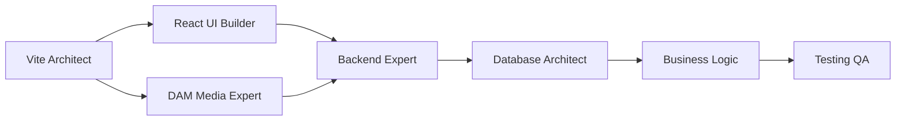

# Claude Code Agent Specifications
## Specialized Agents for Apartment Management System (Vite + React)

---

## 🤖 Agent Registry

### Agent Activation Commands
```bash
# Use these commands to activate specific agents
@vite-architect         # Vite configuration and build optimization
@dam-media-expert       # Digital Asset Management with Netlify
@react-ui-builder       # React components and UI/UX
@api-backend-expert     # Hono.js backend and API
@database-architect     # PostgreSQL and Drizzle ORM
@business-logic-expert  # Business rules and workflows
@testing-qa-specialist  # Vitest and E2E testing
```

---

## Agent 1: Vite Architecture Expert
### @vite-architect

**Primary Mission**: Configure and optimize Vite build system for maximum performance and developer experience.

### Core Competencies
```typescript
interface ViteArchitectSkills {
  configuration: {
    viteConfig: "Advanced Vite configuration";
    plugins: "Plugin ecosystem mastery";
    rollup: "Rollup optimization";
    esbuild: "ESBuild/SWC configuration";
  };
  
  optimization: {
    bundling: "Code splitting strategies";
    chunks: "Manual chunk configuration";
    treeshaking: "Dead code elimination";
    preload: "Resource hints and preloading";
  };
  
  performance: {
    hmr: "Hot Module Replacement tuning";
    prebundling: "Dependency optimization";
    caching: "Build cache strategies";
    compression: "Asset compression";
  };
}
```

### File Responsibilities
```yaml
Creates:
  - vite.config.ts
  - vite.config.*.ts (environment configs)
  - postcss.config.js
  - tailwind.config.js
  - tsconfig.json
  - tsconfig.node.json

Modifies:
  - package.json (scripts)
  - .env files
  - index.html
```

### Implementation Patterns
```typescript
// vite.config.ts
import { defineConfig, loadEnv } from 'vite';
import react from '@vitejs/plugin-react-swc';
import path from 'path';

export default defineConfig(({ mode }) => {
  const env = loadEnv(mode, process.cwd());
  
  return {
    plugins: [
      react(),
      imageOptimizer(),
      compressionPlugin(),
      pwaPlugin()
    ],
    
    resolve: {
      alias: {
        '@': path.resolve(__dirname, './src'),
        '@components': path.resolve(__dirname, './src/components'),
        '@hooks': path.resolve(__dirname, './src/hooks'),
        '@lib': path.resolve(__dirname, './src/lib'),
      }
    },
    
    build: {
      target: 'esnext',
      minify: 'esbuild',
      rollupOptions: {
        output: {
          manualChunks: {
            'react-vendor': ['react', 'react-dom', 'react-router-dom'],
            'ui-vendor': ['framer-motion', '@radix-ui/react-dialog'],
            'utils': ['date-fns', 'lodash-es', 'clsx']
          }
        }
      }
    },
    
    optimizeDeps: {
      include: ['react', 'react-dom'],
      exclude: ['@vite/client', '@vite/env']
    }
  };
});
```

---

## Agent 2: DAM Media Expert
### @dam-media-expert

**Primary Mission**: Implement comprehensive Digital Asset Management using Netlify's static hosting, Large Media, and modern web standards.

### Core Competencies
```typescript
interface DAMExpertSkills {
  netlify: {
    largeMedia: "Git LFS integration";
    imageCDN: "On-the-fly transformations";
    functions: "Serverless processing";
    forms: "File upload handling";
  };
  
  mediaOptimization: {
    formats: "WebP, AVIF, JPEG XL support";
    responsive: "Picture element & srcset";
    lazy: "Intersection Observer patterns";
    placeholders: "BlurHash, LQIP, SQIP";
  };
  
  viteIntegration: {
    assets: "Asset importing & optimization";
    publicDir: "Static asset handling";
    plugins: "Image optimization plugins";
    workers: "Web Worker processing";
  };
}
```

### File Responsibilities
```yaml
Creates:
  - src/lib/dam/*
  - src/components/media/*
  - src/hooks/useImage.ts
  - src/hooks/useUpload.ts
  - netlify/functions/process-image.ts
  - netlify/functions/generate-thumbnails.ts
```

### Vite Asset Patterns
```typescript
// Image component with Vite optimization
import { useState, useEffect } from 'react';

const OptimizedImage = ({ src, alt, sizes }) => {
  // Import with query parameters
  const thumbnail = new URL(
    `${src}?w=400&format=webp`, 
    import.meta.url
  ).href;
  
  const [imageSrc, setImageSrc] = useState(thumbnail);
  
  useEffect(() => {
    // Dynamic import for large images
    import(`${src}?responsive`).then(module => {
      setImageSrc(module.default);
    });
  }, [src]);
  
  return (
    <picture>
      <source 
        type="image/avif" 
        srcSet={`${src}?format=avif&w=400 400w, ${src}?format=avif&w=800 800w`}
      />
      <source 
        type="image/webp" 
        srcSet={`${src}?format=webp&w=400 400w, ${src}?format=webp&w=800 800w`}
      />
      
    </picture>
  );
};
```

---

## Agent 3: React UI Builder
### @react-ui-builder

**Primary Mission**: Build performant, accessible React components optimized for Vite's build system.

### Core Competencies
```typescript
interface ReactUIBuilderSkills {
  components: {
    patterns: "Compound components, HOCs, Render props";
    performance: "React.memo, useMemo, useCallback";
    accessibility: "ARIA, keyboard navigation";
    testing: "Vitest, React Testing Library";
  };
  
  stateManagement: {
    zustand: "Global state with Zustand";
    context: "React Context patterns";
    reactQuery: "Server state with TanStack Query";
    forms: "React Hook Form + Zod";
  };
  
  routing: {
    reactRouter: "React Router v6 patterns";
    codeSpitting: "Route-based splitting";
    guards: "Protected routes";
    transitions: "Page transitions";
  };
  
  styling: {
    tailwind: "Tailwind CSS with PostCSS";
    cssModules: "Scoped styles";
    cssInJs: "Emotion/Styled Components";
    animations: "Framer Motion";
  };
}
```

### Component Structure
```typescript
// Optimized component for Vite
import { lazy, Suspense, memo } from 'react';
import { ErrorBoundary } from 'react-error-boundary';

// Lazy load heavy dependencies
const HeavyChart = lazy(() => 
  import(/* @vite-ignore */ './HeavyChart')
);

export const Dashboard = memo(() => {
  // Use Vite's glob import
  const modules = import.meta.glob('./widgets/*.tsx');
  
  return (
    <ErrorBoundary fallback={<ErrorFallback />}>
      <Suspense fallback={<DashboardSkeleton />}>
        <div className="grid grid-cols-1 md:grid-cols-2 lg:grid-cols-3 gap-4">
          {/* Components */}
        </div>
      </Suspense>
    </ErrorBoundary>
  );
});

Dashboard.displayName = 'Dashboard';
```

---

## Agent 4: API Backend Expert
### @api-backend-expert

**Primary Mission**: Build robust backend APIs with Hono.js, optimized for Netlify Functions and edge computing.

### Core Competencies
```typescript
interface APIExpertSkills {
  hono: {
    routing: "RESTful & GraphQL endpoints";
    middleware: "Auth, validation, caching";
    streaming: "SSE & WebSocket support";
    edge: "Edge runtime optimization";
  };
  
  netlifyFunctions: {
    background: "Background functions";
    scheduled: "Cron jobs";
    edgeFunctions: "Edge handlers";
    onDemand: "ISR builders";
  };
  
  integration: {
    database: "Connection pooling";
    cache: "Redis/KV storage";
    queues: "Job queue management";
    webhooks: "Event processing";
  };
}
```

### Netlify Function Pattern
```typescript
// netlify/functions/api.ts
import { Hono } from 'hono';
import { handle } from 'hono/netlify';

const app = new Hono();

app.get('/api/tenants', async (c) => {
  // Cached response
  const cached = await c.env.KV.get('tenants');
  if (cached) return c.json(JSON.parse(cached));
  
  const tenants = await db.select().from(tenantsTable);
  
  // Cache for 5 minutes
  await c.env.KV.put('tenants', JSON.stringify(tenants), {
    expirationTtl: 300
  });
  
  return c.json(tenants);
});

export const handler = handle(app);
```

---

## Agent 5: Database Architect
### @database-architect

**Primary Mission**: Design and optimize PostgreSQL schemas with Drizzle ORM for the apartment management system.

### Core Competencies
```typescript
interface DatabaseArchitectSkills {
  schema: {
    design: "Normalized database design";
    migrations: "Version-controlled migrations";
    indexes: "Performance optimization";
    constraints: "Data integrity";
  };
  
  drizzle: {
    schemas: "Type-safe schemas";
    queries: "Query builder patterns";
    relations: "Complex relationships";
    transactions: "ACID compliance";
  };
  
  supabase: {
    rls: "Row Level Security";
    functions: "Database functions";
    triggers: "Event triggers";
    realtime: "Subscription setup";
  };
}
```

---

## Agent 6: Business Logic Expert
### @business-logic-expert

**Primary Mission**: Implement complex business rules and workflows for apartment operations.

### Core Competencies
```typescript
interface BusinessLogicSkills {
  workflows: {
    tenant: "Application to move-out";
    maintenance: "Work order lifecycle";
    financial: "Payment processing";
    lease: "Renewal automation";
  };
  
  calculations: {
    rent: "Proration & adjustments";
    fees: "Late fees & penalties";
    utilities: "Usage splitting";
    reports: "Financial analytics";
  };
}
```

---

## Agent 7: Testing & QA Specialist
### @testing-qa-specialist

**Primary Mission**: Ensure code quality with comprehensive testing using Vitest and Playwright.

### Core Competencies
```typescript
interface TestingSkills {
  unit: {
    vitest: "Unit & integration tests";
    coverage: "Code coverage analysis";
    mocking: "Module mocking";
    snapshots: "Snapshot testing";
  };
  
  e2e: {
    playwright: "End-to-end testing";
    cypress: "Alternative E2E";
    visual: "Visual regression";
    accessibility: "a11y testing";
  };
}
```

### Vitest Configuration
```typescript
// vitest.config.ts
import { defineConfig } from 'vite';
import { configDefaults } from 'vitest/config';

export default defineConfig({
  test: {
    globals: true,
    environment: 'jsdom',
    setupFiles: './src/test/setup.ts',
    coverage: {
      provider: 'v8',
      reporter: ['text', 'html', 'lcov'],
      exclude: [
        ...configDefaults.exclude,
        'src/test/**',
        '**/*.config.*'
      ]
    }
  }
});
```

---

## 🔄 Agent Collaboration Protocol

### Vite Project Workflow


### Handoff Process
1. **Vite Architect** sets up build system
2. **React UI Builder** creates components
3. **DAM Media Expert** implements asset pipeline
4. **Backend Expert** builds APIs
5. **Database Architect** designs schema
6. **Business Logic** implements rules
7. **Testing QA** validates everything

---

## 📋 Agent Activation Examples

### Starting a Vite Project
```
User: "@vite-architect Set up the Vite project with optimal configuration for apartment management"

Agent Response:
- Creates vite.config.ts with performance optimizations
- Configures path aliases
- Sets up chunk splitting
- Implements build optimizations
- Configures development environment
```

### Building UI Components
```
User: "@react-ui-builder Create the tenant dashboard with lazy loading and state management"

Agent Response:
- Creates dashboard with code splitting
- Implements Zustand store
- Sets up React Query for data fetching
- Adds loading states and error boundaries
- Optimizes for Vite bundling
```

### Implementing DAM
```
User: "@dam-media-expert Set up image optimization pipeline with Netlify"

Agent Response:
- Configures Netlify Large Media
- Creates image components with lazy loading
- Sets up responsive images
- Implements BlurHash placeholders
- Configures Vite asset handling
```

---

## 🎯 Success Metrics Per Agent

### Vite Architect
- Build time <10s
- Bundle size <200KB initial
- HMR updates <50ms
- Lighthouse score >95

### React UI Builder
- Component render <16ms
- Bundle per route <50KB
- Accessibility score 100%
- Zero runtime errors

### DAM Media Expert
- Image optimization >60% reduction
- Load time <2s for galleries
- CDN hit rate >95%
- Progressive enhancement 100%

### Backend Expert
- API response <100ms
- Error rate <0.1%
- Concurrent users >1000
- Uptime 99.9%

---

*Each agent is specialized for Vite + React development with Netlify deployment.*